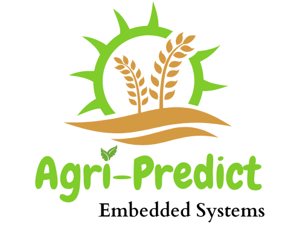

## Agri-Predict Web Application

Agri-Predict is an embedded system and machine learning-based model focused on future crop forecasting, providing farmers with recommendations based on soil and environmental conditions. This web application offers an intuitive interface for users to interact with the predictive model and make informed decisions about crop cultivation.





## Features

- **Crop Prediction:** Predicts the best crop to grow based on current sensor values such as nitrogen, phosphorus, potassium, temperature, humidity, pH, and rainfall.

- **Machine Learning Models:** Utilizes various machine learning algorithms including Decision Tree, Naive Bayes, SVM, Logistic Regression, and Random Forest for crop prediction.

- **Contact Form:** Allows users to reach out for inquiries or support.

## Sensor Values

The web app provides real-time sensor values for nitrogen, phosphorus, potassium, temperature, humidity, pH, and rainfall. These values are crucial inputs for the crop prediction model.

## Prediction

Based on the current sensor values, the web app predicts the best crop to grow, facilitating informed decision-making for farmers.


## Beta Version

Please note that Agri-Predict is currently in beta version, and we welcome any suggestions or improvements to enhance its functionality and user experience.


## Getting Started

**To run the Agri-Predict web app locally, follow these steps:**

1. Clone this repository:

```bash
git clone https://github.com/AmoKorankye/Agri-Predict.git
```

2. Install the required dependencies:

```bash
pip install -r requirements.txt
```

3. Run the Streamlit app:

```bash
streamlit run app.py
```

4. Access the web app in your browser at `http://localhost:8501`.

---